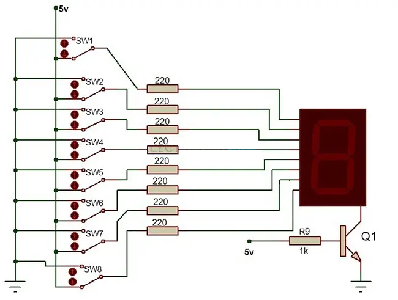
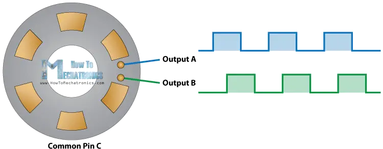

# FPGA Sequencer
Eddy Pan, Arianne Fong, Amanda Chang, Laurel Cox  
December 17, 2025


## Video Demonstration

**YouTube Short:** [FPGA Sequencer: Creating Beats](https://youtube.com/shorts/fpga-sequencer-demo)

**Tetris Audio Demo:** [FPGA Sequencer: Tetris Theme Demo](https://www.youtube.com/shorts/HQIssS48aXo) Our sequencer playing the Tetris theme song.

## Project Overview

We built a functional _Digital Beat Sequencer_ in SystemVerilog on an ice40 FPGA. Our MVP consists of three integrated subsystems: the Core Sequencer Logic, the Audio Output, and the Visual Output. For the core logic, we use a 4x4 Keypad Matrix to program the memory addresses of a 16-step sequence, determining which beats trigger a sound. The audio output is monophonic; a rotary encoder sets the tone by mapping user input to one of eight selectable pitches within a single octave. This tone is generated as a basic digital square wave and output directly to a buzzer, bypassing the need for a DAC. Finally, for visual output, we use a seven-segment display to show the tone currently selected by the rotary encoder.

## Digital Design Modules

### Data Model: `model.sv`

This module keeps track of the updates to the sequencer state—tracking which beats have what pitches. Since we planned for 16 beats, and each beat can have 4 bits worth of pitch (8 notes of the C4-C5 octave and no pitch), we keep our state in the `beats` register—64 bits total, where the first four bits represent the pitch of the first beat, the next four bits represent the pitch of the second beat, and so on. We use an `always_ff` block on the positive edge of the clock to update the `beats` register according to the `data_in` input.

### Button Matrix Input Controller: `button_matrix_controller.sv`

The `button_matrix_controller` performs matrix scanning and button debouncing (10ms) on the 4x4 Button Matrix peripheral. The Button Matrix uses 8 pins total—4 for rows and 4 for columns. By reading in all the column pins as inputs and writing the row pins as outputs, we can figure out which button was pressed. Using a simple FSM, during the output state, the FPGA keeps all row outputs `HIGH` and sequentially picks one to pull down to `LOW`. Then, during the scan state, the FPGA checks which column was pulled `LOW` and outputs the index of the button, turning on a flag that a button was pressed.

To implement debouncing, we use a clock divider such that the scanning only occurs every 10ms, which works smoothly during real-time testing of the button matrix debouncing. The user does not experience any latency.

We found that the button matrix was quite noisy. This was a result of the weak internal pull-ups in the row output pins. The high impedance on those pins caused stray EMI to falsely trigger the buttons and program notes unintentionally. To solve this, we added external pull-up resistors.

### Common-Cathode Seven Segment Display: `seven_segment.sv`


Figure #1: Seven Segment Display wiring diagram. Source: [https://www.allelcoelec.com/blog/7-Segment-Display-Basics,Pinout,Types,Control,and-Uses.html](https://www.allelcoelec.com/blog/7-Segment-Display-Basics,Pinout,Types,Control,and-Uses.html)

### Rotary Encoder

Our display has 8 pin inputs, each corresponding to a different segment in the display, where the 8th segment is the decimal point. Each pin connects to our FPGA through a 330-ohm current-limiting external resistor for the LED. The common cathode pins connect to ground. In `top`, the rotary encoder module instance outputs the pitch data corresponding to its current position as `rotary_position`, and the `u_seven_segment` module instance takes the `rotary_position` value in to determine what letter to display. For example, the note `7'b1011001` corresponds to the letter C, where `1`s correspond to the LED being illuminated. The bit indices of each note's local parameter correspond to the segment ordering `GFEDCBA`. When the program is running, the display shows the note that the rotary encoder is prepped to install in a given beat.

### Rotary Encoder: `rotary_encoder.sv`

We use a rotary encoder to control the pitch that is played on a beat. The rotary encoder module inputs signals from the rotary encoder and outputs whether the button was pressed (`button_pressed`) and a four-bit value representing the rotational position of the rotary encoder (`rotary_position`). `rotary_position` increases if the rotary encoder is turned counterclockwise and decreases if it is turned clockwise. The module can tell the direction the rotary encoder is turned by comparing the values of `signal_a` and `signal_b` from the rotary encoder.

  
Figure #2: Output signals from rotary encoder hardware. Source: [https://howtomechatronics.com/tutorials/arduino/rotary-encoder-works-use-arduino/\#google\_vignette](https://howtomechatronics.com/tutorials/arduino/rotary-encoder-works-use-arduino/#google_vignette) 

The values of `signal_a` and `signal_b` as the rotary encoder spins determine rotation direction. When the contacts touch the output pins, their value is high. The direction of rotation determines whether `signal_a` or `signal_b` goes high first. Thus, by comparing which value is high and whether the other value is also high at the same time, we can determine the direction of rotation.


### Audio Controller: `audio_controller.sv`

The `audio_controller` module handles the clock divider to play each beat and connects the `pwm_decoder` and `pwm_generator` modules from the `pwm` module. At each beat, it references the data model state register and writes the pitch to `pwm_out`.

### PWM: `pwm.sv`

There are two PWM modules: `pwm_decoder` and `pwm_generator`. The decoder takes the clocks and a 4-bit representation of a note. It then decodes the note and outputs the corresponding frequency coefficient. To calculate the coefficient, `pwm_interval` (`N`), we use the equation:

$$N = \frac{f_{clk}}{2 \cdot f_{tone}}$$

The generator then receives the decoder output and generates a PWM wave using a counter that times the signal based on `pwm_interval`.

### UART Transmitter: `uart_tx.sv`

In order to help visualize the state of the sequencer, we use a UART to USB adapter to send every button press event to `stdin` on a laptop. Then, using a visualizer GUI created in C++ with Qt, we can validate the state of the sequencer model in real-time. In order to sync the clocks between the FPGA and the laptop, we send a sync message whenever the clock resets. We decouple the UART data input and the 8-bit button pressed input keeping track of pitch and beat index. Instead, we send two `0xFF` bytes sequentially, an invalid pitch in our current mapping, to signal to the visualizer to sync its clock with the FPGA's. While there is still delay in processing that signal, it is minimal enough to be unnoticeable by the user.

The `uart_tx` module was not created by us, but adapted to work with the YoSys OSS CAD Suite. We acknowledge the initial implementation which can be found [here](https://github.com/alexforencich/verilog-uart). To adapt it, we refactored out the `uart_if` interface from the `uart_tx` implementation.

### Top Module: `top.sv`

The top module instantiates and connects all of the aforementioned modules together: the data model, button matrix controller, rotary encoder, audio controller, and UART transmitter. For example, the `data_in` of the data model module combines the output of the `button_matrix_controller` and the `rotary_encoder` module. The `data_in` is updated upon an event of the `button_pressed` flag going high managed by the `button_matrix_controller` module.

In addition to the modules, we instantiate a few `always_ff` blocks to handle the UART handshaking and an `always_comb` block to connect the onboard RGB and LED for validating the index of the pressed button.

## Qt Visual Interface & Test-Driven Development

This repo contains a passive Qt GUI visualizer for the FPGA sequencer with 3-bit pitch encoding per beat.

---

### Build Instructions

```bash
mkdir -p build && cd build
cmake .. -DBUILD_TESTS=ON
cmake --build . --parallel 4
```

## Bill of Materials

- **4x4 Keypad Matrix:** [Amazon Link](https://www.amazon.com/Tegg-Matrix-Button-Arduino-Raspberry/dp/B07QKCQGXS)
- **Rotary Encoder (6x):** [Amazon Link](https://a.co/d/9N2CXG3)
- **Buzzer/Small Speaker:** [Amazon Link](https://a.co/d/gRcDAPn)
- **iceBlinkPico FPGA**

## Next Steps

Since this project was both fun and offered great learning opportunities, we're looking to build on top of this project by:

### Hardware Improvements

- **Swap to Adafruit NeoTrellis PCB:** Replace the 4x4 Keypad Matrix with the NeoTrellis for:
  - More satisfying tactile experience
  - RGBs at each button to visualize tones as the sequence builds
  - I2C protocol implementation in SystemVerilog

### Audio Enhancements

- **Digital-to-Analog Converter (DAC):** Implementing a DAC would open the gates to a myriad of audio opportunities:
  - Access to sine waves, sawtooth waves, triangle waves, etc.
  - Implementation of Attack-Decay-Sustain-Release (ADSR) Envelopes

### Communication Features

- **UART RX Module:** Implement a UART receive module on the FPGA to:
  - Send transmissions from the GUI Visualizer to the FPGA over UART
  - Load "punch-ins" into memory from the PC

### Productization

- Turn it into a product by soldering it to perfboard and encasing it

Over the course of the next calendar year, we plan on implementing these features.